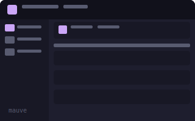
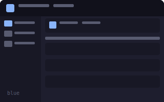
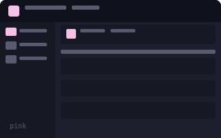
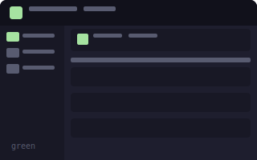
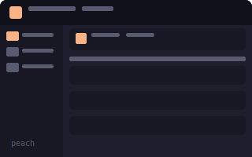
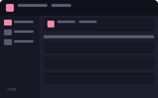
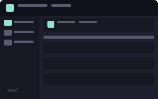
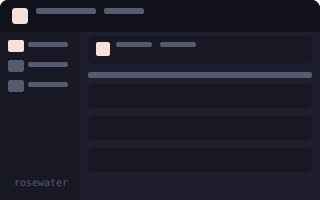
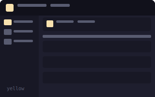

# GTUI

Gmail TUI client built with [Textual](https://textual.textualize.io/), featuring 9 Catppuccin Mocha accent variants.

## Preview

| Mauve | Blue | Pink |
|-------|------|------|
|  |  |  |
| **Green** | **Peach** | **Red** |
|  |  |  |
| **Teal** | **Rosewater** | **Yellow** |
|  |  |  |

## Flavours

- **Mocha Mauve** — primary `#cba6f7`, secondary `#b4befe`
- **Mocha Blue** — primary `#89b4fa`, secondary `#b4befe`
- **Mocha Pink** — primary `#f5c2e7`, secondary `#f2cdcd`
- **Mocha Green** — primary `#a6e3a1`, secondary `#94e2d5`
- **Mocha Peach** — primary `#fab387`, secondary `#f9e2af`
- **Mocha Red** — primary `#f38ba8`, secondary `#eba0ac`
- **Mocha Teal** — primary `#94e2d5`, secondary `#89dceb`
- **Mocha Rosewater** — primary `#f5e0dc`, secondary `#f2cdcd`
- **Mocha Yellow** — primary `#f9e2af`, secondary `#fab387`

## Features

- Gmail API integration (read, send, modify)
- OAuth 2.0 authentication
- 9 Catppuccin Mocha theme variants
- Responsive UI — icon-only mode on narrow terminals
- Nerd Font icons
- Folder navigation (Inbox, Sent, Starred, Drafts, Trash)
- Compose & send emails
- Read email threads
- Mouse support

## Usage

1. Create OAuth credentials at [Google Cloud Console](https://console.cloud.google.com/)
2. Save as `~/.gmail-tui/client_secret.json`
3. Run:

```bash
./gtui.py
```

## Requirements

- Python 3.10+
- [Textual](https://pypi.org/project/textual/) 8.x
- Google API Python Client
- [CaskaydiaCove Nerd Font](https://github.com/ryanoasis/nerd-fonts) (recommended)

## License

MIT
